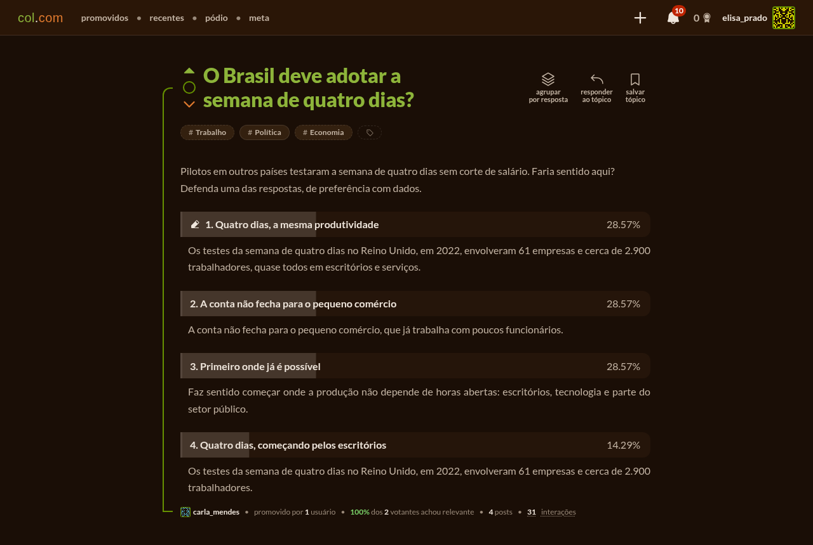
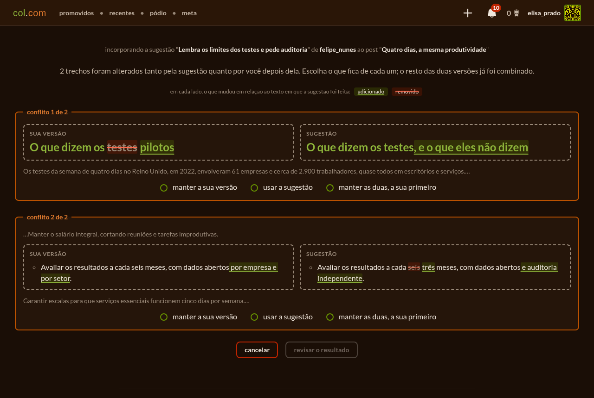
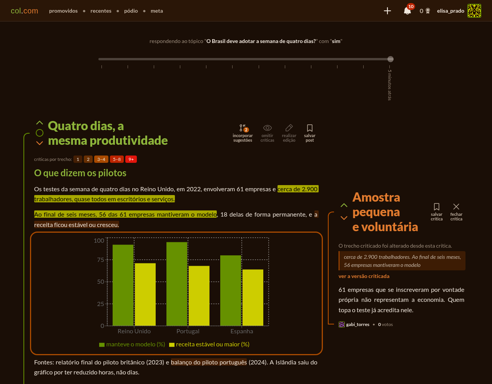
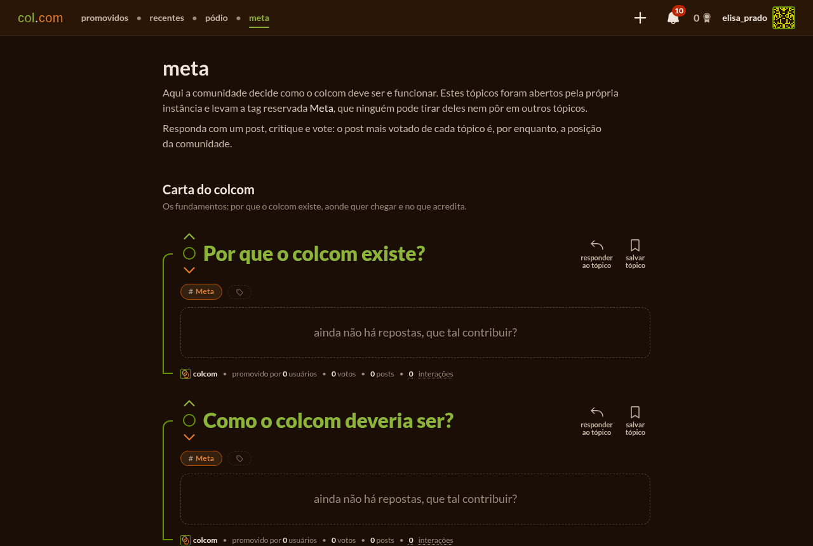

# colcom

[](https://github.com/joallace/colcom/actions/workflows/tests.yml)
[](LICENSE)

**colcom** (*colaboração e competição*) is a forum where every topic is a git repository. People collaborate on each other's texts the way programmers collaborate on code, and compete by critiquing passages and voting in each topic's poll. The aim is dialectics at scale: thesis, antithesis and synthesis, with the strongest ideas from every side surviving critique and convincing across sides.

> **Em português:** o colcom é um fórum de código aberto em que cada tópico é um repositório git. Quem participa colabora sugerindo edições nos textos dos outros (cada sugestão é um *branch*, aceitá-la é um *merge*) e compete criticando trechos e votando na enquete de cada tópico. A ideia é a dialética em escala: tese, antítese e síntese, para que as ideias mais fortes de cada lado sobrevivam à crítica e convençam também o outro lado. Nasceu como um TCC e quer ser uma ferramenta de democracia digital livre e auto-hospedável, ao lado de projetos como o Brasil Participativo, o Pol.is e o Decidim. A interface é toda em português.



colcom is a working prototype with no public instance yet. Read [Status and roadmap](#status-and-roadmap) before running it for a real community.

## Contents

- [Why colcom](#why-colcom)
- [How it works](#how-it-works)
- [Principles](#principles)
- [How it compares](#how-it-compares)
- [Status and roadmap](#status-and-roadmap)
- [Self-hosting](#self-hosting)
- [Development](#development)
- [Contributing](#contributing)
- [License](#license)

## Why colcom

Digital participation tools work, but few people use them. Brasil Participativo, the largest online consultation the Brazilian federal government has run, heard about 1.4 million people for the 2024–2027 multi-year plan. That is under 1% of Brazil's roughly 178 million internet users. Social networks, on the other hand, reach about 81% of them, but they were not built for deliberation: they are linked to polarisation and echo chambers, and they rank content by rules nobody outside the company can see.

colcom bets on a tool that already makes large groups of strangers good at building things together: version control. git lets thousands of programmers propose changes, review them, keep competing versions side by side and record who did what. colcom applies the same model to ideas. A question becomes a repository, each answer a branch that anyone can improve or fork, and every version stays in a history anyone can audit.

The [meta space](#meta) puts colcom's own mission up for debate. The proposal it starts from compares collective opinion to a Monte Carlo estimate: each person who writes, critiques or votes is a sample, and the more samples, the closer the result gets to what people really think. Samples that always come from the same direction converge to the wrong answer, though, so many voices aren't enough: they have to come from every side. In short, the proposed mission is *to approach, through collaboration and competition between ideas, the real collective opinion on the questions that matter, in an open and auditable way.*

## How it works

| What you do | What it is | In git |
|---|---|---|
| Open a **topic** | A question, with the poll's possible answers (e.g. "sim", "não") or open answers | A repository whose `main` branch holds the topic's text |
| Write a **post** | A full answer that defends one of the topic's answers | A branch off `main`; every edit is a commit |
| **Suggest** an edit to someone's post | A proposed change the author can see, accept or reject | A branch off the post; accepting it is a merge |
| **Clone** a post | Your own version of a post, from any of its versions | A new branch from that commit |
| **Critique** a passage | A title and a body anchored to the exact words you quoted, in that version | Stored with the commit it was made against |
| **Vote** | One vote per person per topic, on the post that convinces you most | Every cast, change and removal goes to an append-only log |

**Collaboration.** Anyone can edit any post. When the author edits, it's a new version. When someone else does, it becomes a suggestion: the author sees what it changes, highlighted against the version it started from, and accepts or rejects it. When the suggestion and the author's later edits touch the same lines, colcom first tries to merge them line by line. What still conflicts goes to a resolution page, where the author picks their version, the suggestion's or both for each conflict, then reviews the result.



**Competition.** A critique quotes a passage of one specific version. It follows that passage through every later edit: newer versions highlight it where the passage went, mark it "changed" when the passage was rewritten, and list it under "removed" when the passage is gone. An edit can never make a critique disappear. The slider at the top of a post moves through its versions, and the highlights get warmer where critiques pile up.



**Tags.** Topics carry tags that the community curates. The author's first tags count as their endorsements, and anyone can endorse, contest or propose a tag. A tag shows while it has at least as many endorsements as contests. New tags are provisional until several authors use them, and creating them is limited so they can't be spammed. `/t/a+b` lists the topics that have all of the given tags.

**Notifications.** The bell in the navbar tells you about critiques, suggestions and clones of your posts, new posts in your topics, and answers to your suggestions.

### Meta

`/meta` is where the people using an instance decide how colcom itself should be and work. Every instance opens the same foundational topics, authored by a system account and tagged with the reserved "Meta" tag:

- **Carta do colcom:** why colcom exists (its mission), what it should become (its vision), and which values it should follow.
- **Funcionamento:** how to improve colcom, whether it really promotes consensus, which rules of conduct and moderation it should have, whether meta votes should bind the maintainers, and how to guarantee one person, one vote.

Until synthesis posts exist, the most voted post of each meta topic stands as the community's position.



## Principles

These come from the [design for what comes next](https://claude.ai/code/artifact/c26afe60-54e0-4ef5-901e-7d42ce8d6dbe). They guide every change:

1. **Only people close critiques, never commits.** A new version can move or remove the criticised text, but the critique stays open until the people involved, or the public, decide.
2. **Critiques follow the text.** A critique is visible on every later version, not only on the one it was made against.
3. **Synthesis is a first-class post with provenance.** It competes in the same topic, and its git history shows which posts and versions it came from.
4. **Ranking rewards bridging, not mobilisation.** A post rises by earning approval from more than one side, not by rallying its own.
5. **Every decision is auditable.** Content lives in git, and votes and tags are append-only logs anyone can read. The rules that rank and count are simple enough to explain to any citizen.

Values like plurality, transparency, openness, equality and good faith in debate are proposed in the meta topic "Quais valores o colcom deve seguir?", where each instance's community decides on them.

## How it compares

colcom sits next to established digital-democracy platforms. The comparison below summarises the one in the thesis it started from.

| Platform | What it does | Where colcom differs |
|---|---|---|
| [Pol.is](https://pol.is/) | Collects agree/disagree reactions to short statements, groups participants by opinion (PCA and k-means) and surfaces what the groups have in common. Used in [vTaiwan](https://info.vtaiwan.tw/) since 2014. | Participants write and refine full answers together instead of reacting to short statements. It also works with few participants, and with yes/no or loaded questions, where Pol.is may not perform well. |
| [Decidim](https://decidim.org/) | A modular platform: separate participatory spaces, each built from components such as polls, votes, meetings and debates. [Brasil Participativo](https://brasilparticipativo.presidencia.gov.br/) is an instance of it. | Most of the same uses fit into one structure, a discussion forum, which is quicker for newcomers to learn. |
| [Consul](https://consuldemocracy.org/) | A modular platform built around participatory processes: debates, proposals, voting, collaborative legislation and participatory budgeting. | As with Decidim, a simpler design with comparable reach. |
| [Wikilegis](https://edemocracia.cl.df.leg.br/wikilegis) | Citizens comment on bills article by article, support them and propose new wording. First used by Brazil's Chamber of Deputies. | Not limited to legislation, with a leaner editing interface, and anyone can branch a text into their own version. |

The ranking colcom plans takes its cue from Pol.is and X's Community Notes: a post's score will be its approval in the group that likes it least. colcom already knows each person's side from the poll, so it needs no clustering to find the groups, and the formula stays explainable. The design doc also compares colcom with Audrey Tang and E. Glen Weyl's *⿻ Plurality*.

## Status and roadmap

colcom works end to end: topics, posts with versions, suggestions with conflict resolution, clones, critiques that follow the text, polls with an auditable history, tags, notifications and the meta space. It has unit and integration test suites, and Docker deployment with HTTPS and backups.

**It is not ready for an open, large-scale instance.** Anyone can make several accounts, so a poll can be swung by one person, and there is no moderation yet. The [backlog](TODO.md) ranks what's missing by how much harm it does. Its top items are protection against fake accounts (proof-of-work, email verification, probation for new accounts, invite chains for the first pilot), community moderation through random juries, and LGPD compliance (account deletion, data export, explicit consent for public votes).

The [critique lifecycle and synthesis design](https://claude.ai/code/artifact/c26afe60-54e0-4ef5-901e-7d42ce8d6dbe) is rolling out in six phases:

| Phase | What it adds | Status |
|---|---|---|
| 1. Critiques follow the text | A critique is shown on every later version, wherever its passage went | Done |
| 2. Critique lifecycle | The author addresses or rebuts a critique, and the critic accepts, disputes or withdraws it, with every step in an append-only log | Next |
| 3. Public verdicts | When author and critic disagree, people who voted in the topic decide whether the critique holds | Planned |
| 4. Bridging ranking | A "Consenso" ordering, by approval across sides, next to the raw poll | Planned |
| 5. Synthesis posts | A new post that combines posts from different sides, with a merge commit recording its sources | Planned |
| 6. Re-synthesis and lineage | Bringing later changes of the sources into a synthesis, and a view of its family tree | Planned |

## Self-hosting

An instance is four containers: PostgreSQL, the backend, nginx serving the frontend, and an optional certbot for HTTPS. You need Docker with Compose and a Linux machine. The containers use host networking, so nginx takes ports 80 and 443 and Postgres listens on `localhost:5434`.

### Quick start

```sh
git clone https://github.com/joallace/colcom.git
cd colcom
cp .env.example .env
# Set ACCESS_TOKEN_SECRET (32+ characters, e.g. `openssl rand -hex 32`) and POSTGRES_PASSWORD in .env
docker compose up --build -d
```

colcom is then served at `http://<your machine>/`, with the API under `/api/`. The database schema is applied on every start, and so are the meta space's system account, tag and topics, when missing.

### Configuration

Every setting lives in `.env`, and [`.env.example`](.env.example) explains each one.

| Setting | Required | What it does |
|---|---|---|
| `ACCESS_TOKEN_SECRET` | Yes | Signs login tokens; at least 32 characters |
| `POSTGRES_PASSWORD` | Yes | The database password, used when its volume is first created |
| `DOMAIN`, `LETSENCRYPT_EMAIL` | No | Turns on HTTPS (see below) |
| `CORS_ORIGIN` | No | Other origins allowed to call the API; one origin needs none |
| `TRUST_PROXY` | No | Which proxies may report the client's IP; the default fits nginx on the same machine |
| `RATE_LIMIT_LOGIN`, `RATE_LIMIT_SIGN_UP`, `RATE_LIMIT_CONTENTS`, `RATE_LIMIT_INTERACTIONS` | No | Limits on failed logins and sign-ups per IP, and on writes and votes per user, as `<requests>/<window>` or `off` |
| `TAG_MIN_ACCOUNT_DAYS`, `TAG_CREATE_PER_DAY`, `TAG_ACTIVATION_TOPICS`, `TAG_PROVISIONAL_DAYS` | No | Who can create tags, how many, and when a new tag becomes active or expires |
| `VITE_API_ADDRESS` | No | Where the built frontend calls the API; defaults to `/api` on the same origin |

### HTTPS

Point your domain's DNS at the machine, open ports 80 and 443, and set `DOMAIN` (and optionally `LETSENCRYPT_EMAIL`) in `.env`. The `certbot` service gets a Let's Encrypt certificate and checks twice a day whether it needs renewing. nginx serves plain HTTP, answering the certificate challenge, until the certificate exists, then switches to HTTPS and redirects HTTP to it. Set `LETSENCRYPT_STAGING=1` to try the setup without hitting Let's Encrypt's rate limits. Without `DOMAIN`, nginx serves plain HTTP and certbot exits.

nginx also sends the security headers, including a Content-Security-Policy, from [`nginx/headers.conf`](nginx/headers.conf).

### Backups

Postgres and the git repositories have to be backed up together. The git repositories are the tamper-evident record of every text, so losing them loses the audit trail.

```sh
docker compose -f docker-compose.yml -f backup-service.yml run --rm backup
```

This dumps the database and archives the repositories into `./backups`, keeping the newest 14. Restoring, scheduling with cron, and checking that Postgres and git agree (`npm run check:consistency` in `backend/`) are covered in [`backend/scripts/backup/README.md`](backend/scripts/backup/README.md).

### Updating

```sh
git pull
docker compose up --build -d
```

There is no stable release yet, and the database schema may change in ways that need a fresh database. This will change once instances exist.

## Development

### Stack

| Part | Built with |
|---|---|
| Frontend (`frontend/`) | React 19, React Router 7, TipTap 3 (ProseMirror), Recharts 3, Vite, SCSS |
| Backend (`backend/`) | Express 5, TypeScript, `pg`, pino |
| Shared validation (`shared/`) | JSON Schemas checked with Ajv by both the forms and the API, plus the line-based three-way merge |
| Data | PostgreSQL 18 for users, contents, votes and anything counted; one git repository per topic for the versioned texts |
| Serving | nginx, Docker Compose, certbot |

A post's full text lives only in git (Postgres keeps a 280-character summary), stored one block element per line so git can diff and merge it. Since Postgres and git can't share a transaction, the backend removes the row it just inserted when the git write fails.

### Requirements

- [Bun](https://bun.sh/) for the dev servers, and Node.js 24 or newer for builds, tests and scripts
- git 2.38 or newer (the backend refuses to start with older versions; on Ubuntu 22.04 use `ppa:git-core/ppa`)
- PostgreSQL: the compose `db` service works (`docker compose up db`, on port 5434), and the test suite starts its own throwaway cluster from the local binaries

### Running locally

```sh
cd backend && npm install && cd ../frontend && npm install && cd ..
```

Create `backend/.env` with at least `ACCESS_TOKEN_SECRET`, `POSTGRES_PASSWORD` and `PGPORT` (5434 for the compose database), then start the frontend on port 5173 and the backend on port 3000:

```sh
(cd frontend && bun run dev -- --host)
(cd backend && bun --watch src/server.ts)
```

[`run.sh`](run.sh) opens both in GNOME Terminal windows. In development the frontend calls `http://localhost:3000`, and `VITE_API_ADDRESS` in `frontend/.env` overrides it.

### Mock data

With the backend running on an empty database, fill it with users, topics, posts with edits and charts, suggestions in every state, critiques, votes, tags and notifications:

```sh
RATE_LIMIT_SIGN_UP=off TAG_MIN_ACCOUNT_DAYS=0 bun --watch src/server.ts   # in backend/, so the seed isn't rate limited
npm run seed                                                             # in backend/; API=http://host:port targets another instance
```

Every seeded user's password is `colcom123`. Log in as `elisa_prado` to try the conflict resolution page on her four-day week post. The screenshots in this README come from this data.

### Tests

```sh
npm test            # in backend/ and in frontend/
npm run lint        # in frontend/; kept free of errors and warnings
```

The backend's integration tests drive the real app over HTTP against a real Postgres and real git repositories, each test file in its own database. Set `TEST_POSTGRES_HOST` to use a running server instead of a throwaway cluster. GitHub Actions runs both suites on every push. `npm run loadtest:bench` in `backend/` measures throughput under concurrent load and checks that no write was lost.

### Where to read more

- [`AGENTS.md`](AGENTS.md): the architecture in depth, the content model, validation and conventions
- [`backend/AGENTS.md`](backend/AGENTS.md) and [`frontend/AGENTS.md`](frontend/AGENTS.md): each package's layout and pitfalls
- [`TODO.md`](TODO.md): the backlog, ranked by criticality, with the decisions taken so far

## Contributing

Issues and pull requests are welcome. The [backlog](TODO.md) is the best place to find something to work on, and the meta topics on a running instance are the place to argue about where colcom should go.

- The interface and API messages are in Portuguese; code, comments and commit messages are in English.
- Commits follow `type(scope): Subject`, e.g. `fix(frontend): Restores title editing in Firefox prior to version 136`.
- Add or update tests with every change, and keep both suites green.

## License

colcom is free software under the [GNU Affero General Public License v3.0](LICENSE). If you run a modified version for others over a network, you must offer them its source.
